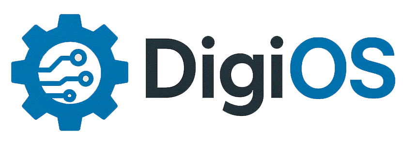

# 🚀 Digi-OS - Sistema de Gerenciamento de Ordens de Serviço

<div align="center">



**Sistema completo para gerenciamento de Ordens de Serviço (OS) para empresas de serviços de informática**

[](https://openjdk.java.net/)
[](https://spring.io/projects/spring-boot)
[](https://reactjs.org/)
[](https://www.typescriptlang.org/)
[](https://www.postgresql.org/)

</div>

## 📋 Índice

- [Sobre o Projeto](#-sobre-o-projeto)
- [Funcionalidades](#-funcionalidades)
- [Tecnologias Utilizadas](#-tecnologias-utilizadas)
- [Pré-requisitos](#-pré-requisitos)
- [Instalação e Configuração](#-instalação-e-configuração)
- [Como Usar](#-como-usar)
- [Estrutura do Projeto](#-estrutura-do-projeto)
- [API Endpoints](#-api-endpoints)
- [Contribuição](#-contribuição)
- [Licença](#-licença)

## 🎯 Sobre o Projeto

O **Digi-OS** é um sistema completo de gerenciamento de Ordens de Serviço desenvolvido para empresas de serviços de informática. O sistema oferece uma solução robusta para controle de serviços, clientes, produtos e relatórios, com interface moderna e intuitiva.

### Principais Características

- ✅ **Interface Moderna**: Frontend responsivo com React e TypeScript
- ✅ **Backend Robusto**: API REST com Spring Boot e segurança JWT
- ✅ **Banco de Dados**: PostgreSQL com JPA/Hibernate
- ✅ **Relatórios**: Geração de PDF e relatórios em tempo real
- ✅ **Dashboard**: Visualização de métricas e estatísticas
- ✅ **Multi-usuário**: Sistema de roles (Administrador/Cliente)

## 🚀 Funcionalidades

### 👨‍💼 Administrador

- **Gestão Completa de OS**: Criar, editar, visualizar e excluir ordens de serviço
- **Dashboard Administrativo**: Métricas em tempo real, gráficos e estatísticas
- **Gerenciamento de Usuários**: CRUD completo de usuários do sistema
- **Gestão de Clientes**: Cadastro e controle de clientes
- **Produtos e Serviços**: Controle de estoque e catálogo de serviços
- **Relatórios**: Geração de relatórios por período e exportação em PDF
- **Configurações**: Personalização do sistema

### 👤 Cliente

- **Visualização de OS**: Acompanhamento de ordens de serviço
- **Status em Tempo Real**: Monitoramento do progresso dos serviços
- **Histórico**: Acesso ao histórico completo de serviços
- **Perfil**: Gerenciamento de dados pessoais

## 🛠️ Tecnologias Utilizadas

### Backend

- **Java 17** - Linguagem principal
- **Spring Boot 3.2.0** - Framework para desenvolvimento
- **Spring Security** - Autenticação e autorização
- **Spring Data JPA** - Persistência de dados
- **PostgreSQL 15** - Banco de dados
- **JWT** - Autenticação stateless
- **Apache PDFBox** - Geração de relatórios PDF
- **Swagger/OpenAPI** - Documentação da API
- **Lombok** - Redução de código boilerplate

### Frontend

- **React 18.2.0** - Biblioteca JavaScript
- **TypeScript 5.2.2** - Tipagem estática
- **Vite** - Build tool e dev server
- **TailwindCSS 3.3.3** - Framework CSS
- **React Router DOM** - Roteamento
- **Axios** - Cliente HTTP
- **Chart.js** - Gráficos e visualizações
- **Headless UI** - Componentes acessíveis
- **Heroicons** - Ícones

### DevOps

- **Docker & Docker Compose** - Containerização
- **Maven** - Gerenciamento de dependências
- **npm** - Gerenciamento de pacotes Node.js

## 📋 Pré-requisitos

Antes de começar, certifique-se de ter instalado:

- **Java 17** ou superior
- **Node.js 18** ou superior
- **npm** ou **yarn**
- **Maven 3.6** ou superior
- **Docker** e **Docker Compose** (opcional, mas recomendado)
- **Git**

## 🚀 Instalação e Configuração

### 1. Clone o Repositório

```bash
git clone https://github.com/seu-usuario/digi-os.git
cd digi-os
```

### 2. Configuração do Banco de Dados

#### Opção A: Usando Docker (Recomendado)

```bash
# Inicie o PostgreSQL e pgAdmin
docker-compose up -d

# O banco estará disponível em:
# PostgreSQL: localhost:5432
# pgAdmin: http://localhost:5050 (admin@admin.com / admin123)
```

#### Opção B: Instalação Local

1. Instale o PostgreSQL 15
2. Crie um banco de dados chamado `sistema_os`
3. Configure as credenciais no arquivo `backend/src/main/resources/application.yml`

### 3. Configuração do Backend

```bash
# Entre na pasta do backend
cd backend

# Compile o projeto
mvn clean compile

# Execute o backend
mvn spring-boot:run

# O backend estará disponível em: http://localhost:8080
# Documentação da API: http://localhost:8080/swagger-ui.html
```

### 4. Configuração do Frontend

```bash
# Em outro terminal, entre na pasta do frontend
cd frontend

# Instale as dependências
npm install

# Execute o frontend
npm run dev

# O frontend estará disponível em: http://localhost:5173
```

## 📖 Como Usar

### Primeiro Acesso

1. **Acesse o sistema**: http://localhost:5173
2. **Faça login** com as credenciais padrão:
   - **Administrador**: `fernando@sistemaos.com` / `123456`
   - **Operador**: `joao.pedro@sistemaos.com` / `123456`

### Funcionalidades Principais

#### Dashboard

- Visualize métricas em tempo real
- Acompanhe ordens de serviço pendentes
- Analise gráficos de performance

#### Ordens de Serviço

- **Criar OS**: Preencha os dados do cliente e serviços
- **Editar OS**: Modifique informações conforme necessário
- **Visualizar OS**: Acompanhe o status e detalhes
- **Gerar PDF**: Exporte a OS em formato PDF

#### Gestão de Clientes

- Cadastre novos clientes
- Mantenha informações atualizadas
- Visualize histórico de serviços

#### Produtos e Serviços

- Controle o catálogo de produtos
- Gerencie tipos de serviços
- Monitore estoque

## 📁 Estrutura do Projeto

```
digi-os/
├── backend/                 # Backend Spring Boot
│   ├── src/main/java/
│   │   └── com/sistemaos/
│   │       ├── config/      # Configurações
│   │       ├── controller/  # Controllers REST
│   │       ├── domain/      # Entidades e DTOs
│   │       ├── repository/  # Repositórios JPA
│   │       ├── security/    # Configurações de segurança
│   │       └── service/     # Lógica de negócio
│   └── src/main/resources/
│       └── application.yml  # Configurações
├── frontend/                # Frontend React
│   ├── src/
│   │   ├── components/      # Componentes React
│   │   ├── pages/          # Páginas da aplicação
│   │   ├── contexts/       # Contextos React
│   │   ├── types/          # Tipos TypeScript
│   │   └── lib/            # Utilitários
│   └── public/             # Arquivos estáticos
├── docker-compose.yml      # Configuração Docker
└── README.md              # Este arquivo
```

## 🔌 API Endpoints

### Autenticação

- `POST /api/auth/registrar` - Registro de usuário
- `POST /api/auth/login` - Login de usuário

### Ordens de Serviço

- `GET /api/ordens-servico` - Lista todas as OS
- `POST /api/ordens-servico` - Cria nova OS
- `GET /api/ordens-servico/{id}` - Busca OS por ID
- `PUT /api/ordens-servico/{id}` - Atualiza OS
- `DELETE /api/ordens-servico/{id}` - Remove OS
- `GET /api/ordens-servico/{id}/pdf` - Gera PDF da OS
- `GET /api/ordens-servico/cliente/{clienteId}` - Lista OS por cliente
- `GET /api/ordens-servico/periodo` - Lista OS por período

### Usuários

- `GET /api/usuarios` - Lista usuários
- `POST /api/usuarios` - Cria usuário
- `PUT /api/usuarios/{id}` - Atualiza usuário
- `DELETE /api/usuarios/{id}` - Remove usuário

### Clientes

- `GET /api/clientes` - Lista clientes
- `POST /api/clientes` - Cria cliente
- `PUT /api/clientes/{id}` - Atualiza cliente
- `DELETE /api/clientes/{id}` - Remove cliente

### Produtos e Serviços

- `GET /api/produtos` - Lista produtos
- `POST /api/produtos` - Cria produto
- `GET /api/servicos` - Lista serviços
- `POST /api/servicos` - Cria serviço

## 🤝 Contribuição

Contribuições são sempre bem-vindas! Para contribuir:

1. **Fork** o projeto
2. **Crie** uma branch para sua feature (`git checkout -b feature/AmazingFeature`)
3. **Commit** suas mudanças (`git commit -m 'Add some AmazingFeature'`)
4. **Push** para a branch (`git push origin feature/AmazingFeature`)
5. **Abra** um Pull Request

### Padrões de Código

- Use **TypeScript** no frontend
- Siga as convenções do **Spring Boot** no backend
- Mantenha o código **limpo** e **documentado**
- Adicione **testes** para novas funcionalidades

## 📝 Licença

Este projeto está sob a licença **MIT**. Veja o arquivo [LICENSE](LICENSE) para mais detalhes.

## 📞 Suporte

Se você encontrar algum problema ou tiver dúvidas:

- 📧 **Email**: seu-email@exemplo.com
- 🐛 **Issues**: [GitHub Issues](https://github.com/seu-usuario/digi-os/issues)
- 📖 **Documentação**: [Wiki do Projeto](https://github.com/seu-usuario/digi-os/wiki)

---

<div align="center">

**Desenvolvido com ❤️ para facilitar o gerenciamento de ordens de serviço**

</div>
